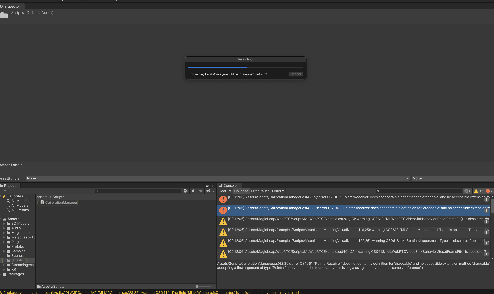
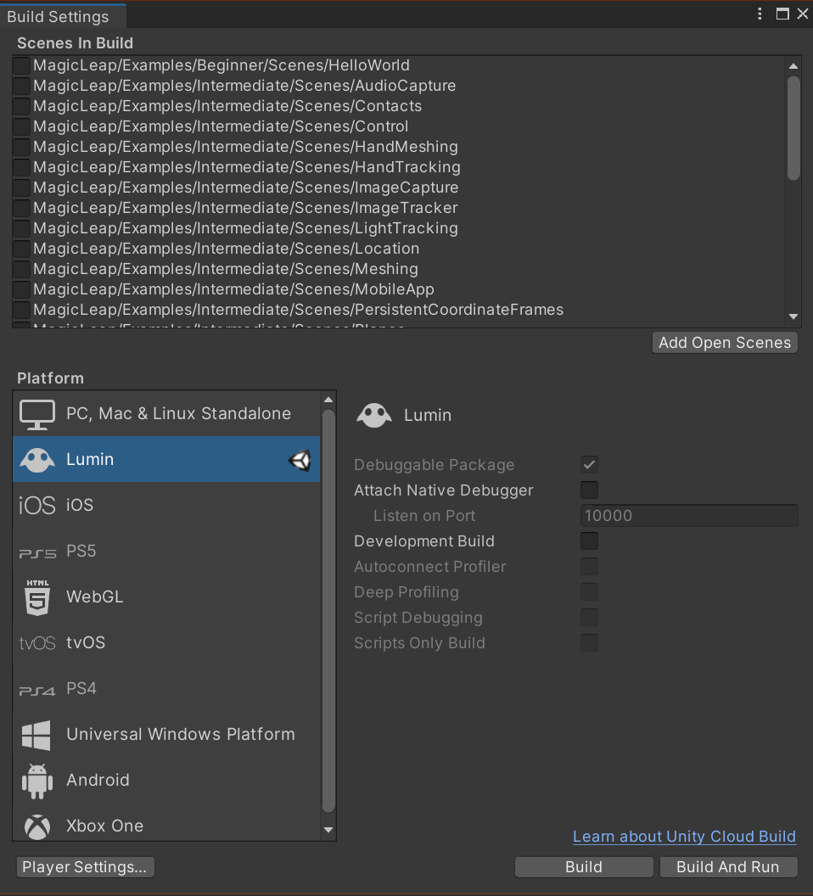
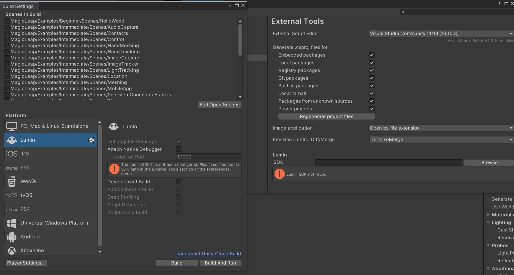

# SixthSenseMagicLeap2

Schizophrenia simulation in AR using Unity and Magic Leap One. 

This project is born at XR Brain Jam 2022. 

# Installation:
- Download Unity version 2020.3.36f1 + Install Lumin OS Module 
- Set up a developer account on magic leap 
- Download [The Lab](https://developer.magicleap.com/en-us/learn/guides/lab)
- Download All files related to Unity under The Lab (The Lab -> Package Manager -> Bundles -> Unity)

- Get SDK path by going to The Lab - Package Manager - My Tools - Common Packages - Lumin SDK - Open Folder 

- You should also have .cert and .privkey in a folder for further setup in Unity ([Check here to get your own certificate](https://developer.magicleap.com/en-us/learn/guides/developer-certificates))
- Open the project 
- You will see errors as below 
- Import the package of MLTK from [magic leap](https://github.com/magicleap/Magic-Leap-Toolkit-Unity)
- ONLY take the .package file and import it to Unity through Unity -> Assets -> Import Package -> Custom Package. More [details on how to import package](https://docs.unity3d.com/560/Documentation/Manual/AssetPackages.html)
- Switch your platform to Lumin OS for magic leap 

- Browse your Lumin SDK path 

- Edit your certificate path (This will be when you deploy your app)

- Reimport all through Unity -> Assets -> Reimport All. This will reimport all the dependencies in Unity and restart it 

